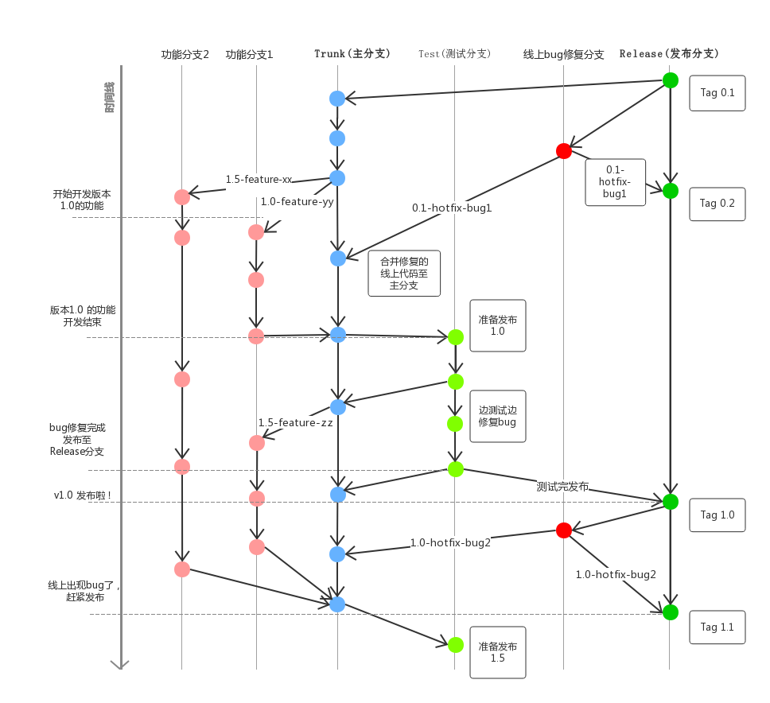

# 开发流程与代码规范

## 开发流程

### 仓库

托管在码云私有仓库上， see: https://gitee.com/

### 测试

使用 Ionic/Angular 默认测试工具即可，根据需求可以微调配置

```bash
# 单元测试
npm run test
# 端到端测试
npm run e2e
```

### 分支管理



### 提交流程

> 参见教程: http://www.ruanyifeng.com/blog/2016/01/commit_message_change_log.html

```bash
git add YOUR_EDITED_FILES
git cz
git push
```

#### 安装 commitizen

commitizen, 可以实现提交提示可视化， see: https://github.com/commitizen/cz-cli  
提交内容主要分为以下几个方面

```bash
feat：新功能（ feature ）
fix：修补bug
docs：文档（ documentation ）
style： 格式（ 不影响代码运行的变动 ）
refactor：重构（ 即不是新增功能，也不是修改bug的代码变动 ）
test：增加测试
chore：构建过程或辅助工具的变动
build: 与构建工具相关的更改
```

```bash
 npm install -g commitizen
 commitizen init cz-conventional-changelog --save --save-exact
```

#### standard-version

使用 standard-version 生成 changelog
see: https://github.com/conventional-changelog/standard-version

```bash
npm i --save-dev standard-version
```

#### commitlint

基于 commitlint 验证 git message 是否规范  
see: https://github.com/marionebl/commitlint

本脚手架使用 angular 规则， 详情参见:  
https://github.com/marionebl/commitlint/tree/master/@commitlint/config-angular

## 代码规范

### 业界参考

- JavaScript 代码规范, 参见业界公认的 airbnb 规范: https://github.com/airbnb/javascript
- Angular 规范，直接参考官网: https://angular.io/guide/styleguide , 默认已集成部分检测工具， 如 `tslint-angular`，手动检测可以执行命令 `npm run lint`

## 工具

这里囊括一些已经用到或者以后需要用到的一些工具

### scsslint

基于 scsslint 验证 sass 代码是否规范
https://sass-guidelin.es/#tools

### codelyzer

基于 codelyzer 检测 ts 代码是否符合规范
see: https://github.com/mgechev/codelyzer

```bash
npm i tslint-angular
```

### husky

通过 husky 可以执行生命周期内的相关钩子，自动验证代码的是否符合规范  
see: https://www.npmjs.com/package/husky

```bash
npm install husky --save-dev
```

### type doc

自动根据注释生成文档的工具，前提是你自己得写好注释  
see: https://github.com/TypeStrong/typedoc/  
建议全局安装

```bash
npm install typedoc --global
typedoc
```

### better-npm-run

能够去除配置文件硬编码,
see: https://github.com/benoror/better-npm-run

```bash
 npm install better-npm-run --save-dev
```

### ionic docker (TODO)

能够屏蔽部署环境差异，
see: https://github.com/marcoturi/ionic-docker
